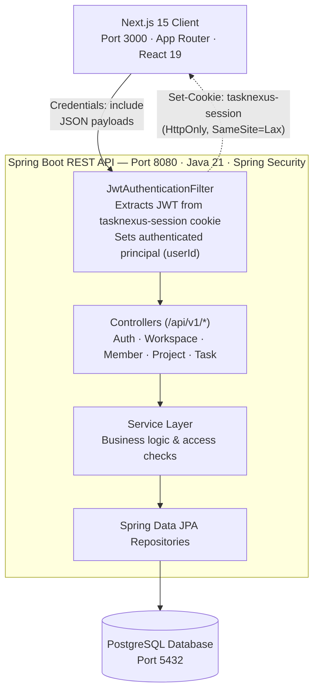
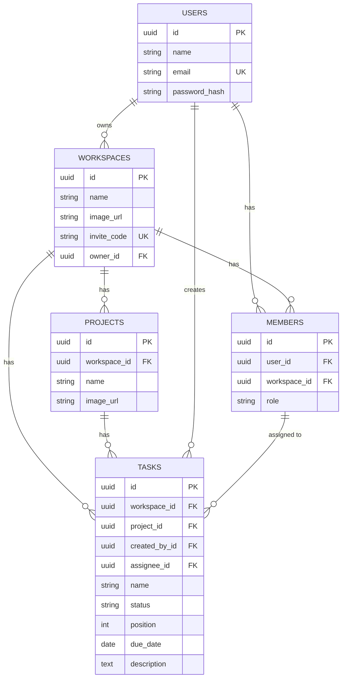

# TaskNexus

A full-stack, enterprise-grade project management application inspired by Atlassian Jira. Designed with a modern decoupled architecture, TaskNexus pairs a high-performance **Spring Boot** REST API backend with a responsive, server-rendered **Next.js 15** frontend.

It provides teams with multi-tenant workspaces, role-based member management, project organization, multi-view task workflows (Kanban with drag-and-drop, interactive data tables, and calendar views), and month-over-month performance analytics.

---

## Table of Contents

- [Project Overview](#project-overview)
- [Key Features](#key-features)
- [Tech Stack](#tech-stack)
- [System Architecture](#system-architecture)
- [Repository Structure](#repository-structure)
- [Prerequisites](#prerequisites)
- [Installation & Setup](#installation--setup)
- [Environment Variables](#environment-variables)
- [Running the Project](#running-the-project)
- [Available Scripts & Commands](#available-scripts--commands)
- [API Reference](#api-reference)
  - [Authentication & Session](#1-authentication--session)
  - [Workspaces](#2-workspaces)
  - [Members](#3-members)
  - [Projects](#4-projects)
  - [Tasks](#5-tasks)
  - [System Health](#6-system-health)
- [Database & Data Models](#database--data-models)
- [Application Configuration](#application-configuration)
- [Testing](#testing)
- [Linting & Formatting](#linting--formatting)
- [Build & Deployment](#build--deployment)
- [Troubleshooting](#troubleshooting)

---

## Project Overview

Modern software development teams require clear visibility into their delivery pipelines. **TaskNexus** delivers an intuitive, fast, and secure project tracking experience designed for cross-functional teams:

- **Isolated Workspaces**: Teams organize work into distinct workspaces with independent memberships, projects, and permissions.
- **Multiple Task Visualizations**: Team members can switch between Kanban boards, structured tables, and schedule calendars depending on their workflow preferences.
- **Security by Design**: Complete separation of concerns between client and server, protected by stateless JWT sessions delivered through secure, `HttpOnly`, `SameSite=Lax` cookies with BCrypt password hashing.
- **Data-Driven Insights**: Real-time analytics tracking task volume, completions, overdues, and velocity trends month-over-month.

---

## Key Features

### 🔐 Authentication & Access Control

- Secure user registration and authentication with BCrypt password encryption.
- Stateless JSON Web Token (JWT) session stored in an `HttpOnly`, `SameSite=Lax` cookie (`tasknexus-session`), safeguarding against cross-site scripting (XSS) and mitigating CSRF attacks.
- Current session resolution (`/api/v1/auth/me`) and clean server-side cookie invalidation on logout.

### 🏢 Workspace Management

- Create, rename, customize, and delete workspaces.
- Fast workspace switcher for instantaneous context switching across projects.
- Cryptographically secure, 8-character invite code generation using unambiguous character sets (`ABCDEFGHJKLMNPQRSTUVWXYZ23456789`) to eliminate human transcription errors.
- One-click join links (`/workspaces/{workspaceId}/join/{inviteCode}`) and instant invite code invalidation/reset.

### 👥 Member & Role Governance

- Workspace-scoped roles: `ADMIN` and `MEMBER`.
- Role-based authorization: Admins can update roles, invite teammates, and remove members.
- Guardrails protecting workspace integrity: prevents non-admins from altering members and prevents removing the workspace owner.

### 📁 Project Management

- Multiple projects per workspace with custom names and avatars.
- Scoped project analytics and project-specific task filtering.
- Strict workspace-boundary validation ensuring cross-workspace data leakage is blocked.

### 📋 Agile Task Management

- Five task lifecycle statuses: `BACKLOG`, `TODO`, `IN_PROGRESS`, `IN_REVIEW`, and `DONE`.
- **Kanban Board**: Drag-and-drop powered by `@hello-pangea/dnd` with real-time column transitions and position recalculation.
- **Bulk Position Sync**: Atomic updates via `/api/v1/tasks/bulk-update` to persist column movements and ordering.
- **Interactive Data Table**: Sortable, paginated task listings with inline actions powered by TanStack Table.
- **Calendar Schedule**: Visual timeline and deadline tracking with `react-big-calendar`.
- **Multi-Parameter Filtering**: Filter tasks by project, assignee, status, due date, and text search.
- **Comprehensive Task Details**: Modal and dedicated full-page task views with breadcrumb navigation, property overview, and rich text descriptions.

### 📊 Performance Analytics

- High-level dashboards at both workspace and project levels.
- Metrics include: Total Tasks, Assigned Tasks, Completed Tasks, Incomplete Tasks, and Overdue Tasks.
- Automatic month-over-month comparative calculations and delta tracking.

---

## Tech Stack

### Frontend (`client/`)

| Technology                | Version       | Purpose                                                           |
| :------------------------ | :------------ | :---------------------------------------------------------------- |
| **Next.js**               | 15.2.3        | React framework with App Router, SSR, and dynamic routing         |
| **React**                 | 19.0.0        | Core UI library                                                   |
| **TypeScript**            | ^5.0.0        | Static typing across components and data contracts                |
| **Tailwind CSS**          | ^3.4.1        | Utility-first styling with `tailwindcss-animate`                  |
| **Radix UI**              | Latest        | Accessible, unstyled UI primitives (Dialog, Dropdown, Tabs, etc.) |
| **TanStack Query**        | ^5.67.3       | Server state management, caching, and optimistic UI mutations     |
| **TanStack Table**        | ^8.21.2       | Headless, high-performance table management                       |
| **@hello-pangea/dnd**     | ^18.0.1       | Drag-and-drop mechanics for Kanban columns and cards              |
| **React Big Calendar**    | ^1.18.0       | Month/week calendar views for task deadlines                      |
| **React Hook Form & Zod** | ^7.54 / ^3.24 | Form state management and schema-driven validation                |
| **Lucide React**          | ^0.479.0      | Icon set                                                          |
| **Sonner**                | ^2.0.1        | Toast notifications                                               |

### Backend (`backend/`)

| Technology                 | Version          | Purpose                                                   |
| :------------------------- | :--------------- | :-------------------------------------------------------- |
| **Java**                   | 21               | Long-term support (LTS) modern Java runtime               |
| **Spring Boot**            | 4.1.1            | Enterprise application framework                          |
| **Spring Data JPA**        | 4.1.1            | Object-relational mapping and data repository abstraction |
| **Hibernate ORM**          | 7.4.5            | JPA persistence provider and schema validation            |
| **Spring Security**        | 6+               | Filter-chain authentication and endpoint authorization    |
| **JJWT (io.jsonwebtoken)** | 0.12.6           | JWT creation, parsing, and signing                        |
| **PostgreSQL Driver**      | Latest           | Production relational database driver                     |
| **H2 Database**            | Latest           | In-memory database for isolated automated test runs       |
| **Project Lombok**         | Latest           | Boilerplate reduction (getters, setters, constructors)    |
| **Spring Boot Actuator**   | 4.1.1            | Application health and metrics monitoring                 |
| **Apache Maven**           | 3.9.16 (Wrapper) | Dependency management and build lifecycle                 |

---

## System Architecture



---

## Repository Structure

```
TaskNexus-NextJs/
├── backend/                                   # Spring Boot application
│   ├── .mvn/wrapper/                          # Maven wrapper binaries and configuration
│   ├── src/
│   │   ├── main/
│   │   │   ├── java/com/denzil/project_management/
│   │   │   │   ├── auth/                      # Authentication: controllers, DTOs, service
│   │   │   │   ├── member/                    # Workspace memberships & role enforcement
│   │   │   │   ├── project/                   # Project domain logic, DTOs, repositories
│   │   │   │   ├── shared/                    # Security, CORS, DTOs, exceptions, BaseEntity
│   │   │   │   ├── task/                      # Task CRUD, status updates, bulk reordering
│   │   │   │   ├── user/                      # User entity and credentials repository
│   │   │   │   └── workspace/                 # Workspace lifecycle, join logic, analytics
│   │   │   └── resources/
│   │   │       ├── application.yaml           # Production-safe default configurations
│   │   │       └── application-dev.yaml       # Dev profile overrides (ddl-auto: update, SQL logs)
│   │   └── test/                              # Mockito & Spring Boot Test suites (H2 in-memory)
│   ├── mvnw / mvnw.cmd                        # Unix and Windows Maven wrapper scripts
│   └── pom.xml                                # Backend build definition and dependencies
│
├── client/                                    # Next.js frontend application
│   ├── public/                                # Static images, icons, and vector assets
│   ├── src/
│   │   ├── app/
│   │   │   ├── (auth)/                        # Sign-in and sign-up route group
│   │   │   ├── (dashboard)/                   # Authenticated dashboard views:
│   │   │   │   └── workspaces/[workspaceId]/  # Workspace, project, task, and analytics routes
│   │   │   ├── (standalone)/                  # Clean standalone views (create, settings, join)
│   │   │   ├── globals.css                    # Tailwind design tokens and CSS variables
│   │   │   └── layout.tsx                     # Global HTML shell and query provider
│   │   ├── components/                        # Shared UI components, sidebar, modals, tables
│   │   ├── features/                          # Feature modules (API hooks, DTO types, UI forms)
│   │   │   ├── auth/                          # Login/registration hooks and avatar buttons
│   │   │   ├── members/                       # Member list table and role management
│   │   │   ├── projects/                      # Project creation, editing, and analytics
│   │   │   ├── tasks/                         # Kanban, table, calendar, filters, and modals
│   │   │   └── workspaces/                    # Workspace switcher, settings, invite handlers
│   │   ├── hooks/                             # Utility hooks (useConfirm, useMobile, useToast)
│   │   └── lib/
│   │       ├── api.ts                         # Universal HTTP client with credentials inclusion
│   │       └── utils.ts                       # Class name merging and formatting utilities
│   ├── package.json                           # Frontend scripts and package manifest
│   ├── tailwind.config.ts                     # Tailwind typography and animation themes
│   └── tsconfig.json                          # TypeScript compiler configuration
└── README.md                                  # Comprehensive documentation
```

---

## Prerequisites

Before starting the application locally, ensure you have the following software installed:

1. **Java Development Kit (JDK) 21** or later (e.g., [Eclipse Temurin](https://adoptium.net/)). Verify with:
   ```bash
   java -version
   ```
2. **Node.js (LTS)** v20.x or later and **npm** (or **bun**). Verify with:
   ```bash
   node -v
   npm -v
   ```
3. **PostgreSQL** (v14+) running locally or via Docker. Verify with:
   ```bash
   psql --version
   ```

---

## Installation & Setup

### 1. Clone the Repository

```bash
git clone https://github.com/samueldenzil/TaskNexus-NextJs.git
cd TaskNexus-NextJs
```

### 2. Set Up the Database

Create a new PostgreSQL database for the project:

```sql
CREATE DATABASE tasknexus_db;
```

---

## Environment Variables

### Backend Configuration (`backend/.env` or system environment)

Create a `.env` file in `backend/` or configure your shell environment:

```env
# Database Connection
DB_HOST=localhost
DB_PORT=5432
DB_NAME=tasknexus_db
DB_USERNAME=postgres
DB_PASSWORD=your_postgres_password

# JWT Authentication Secret (Base64-encoded or raw 256-bit secret string)
JWT_SECRET=yFUApYA9S5j85EMAtkduzKcpooIU1Fmgu3F/ozNvmP4=

# Token expiration in milliseconds (e.g., 604800000 = 7 days)
JWT_EXPIRATION_MS=604800000

# Client Application URL (for CORS allowance)
FRONTEND_URL=http://localhost:3000

# Cookie Security (set to false for local HTTP, true for HTTPS in production)
COOKIE_SECURE=false

# Spring Profile
SPRING_PROFILES_ACTIVE=dev
```

### Frontend Configuration (`client/.env`)

Create a `.env` file inside `client/`:

```env
# URL where the Spring Boot backend is accessible
NEXT_PUBLIC_APP_URL=http://localhost:8080
```

---

## Running the Project

### Starting the Backend

From the repository root, navigate into the backend directory and launch the Spring Boot application using the development profile:

**Linux / macOS:**

```bash
cd backend
./mvnw spring-boot:run -Dspring-boot.run.profiles=dev
```

**Windows (cmd / PowerShell):**

```powershell
cd backend
.\mvnw.cmd spring-boot:run -Dspring-boot.run.profiles=dev
```

The backend server will start on **`http://localhost:8080`**.

> [!NOTE]
> The `dev` profile enables Hibernate's `ddl-auto: update`, which automatically generates required database tables on the initial start.

---

### Starting the Frontend

In a separate terminal, navigate into the `client` directory, install dependencies, and launch the development server:

```bash
cd client
npm install
npm run dev
```

Open your browser and navigate to **`http://localhost:3000`**.

---

## Available Scripts & Commands

### Backend (`backend/`)

| Command                           | Action                                                           |
| :-------------------------------- | :--------------------------------------------------------------- |
| `.\mvnw.cmd test` / `./mvnw test` | Runs all unit and context integration tests                      |
| `.\mvnw.cmd clean package`        | Compiles source code, runs tests, and packages an executable JAR |
| `.\mvnw.cmd spring-boot:run`      | Runs the Spring Boot application locally                         |

### Frontend (`client/`)

| Command         | Action                                                        |
| :-------------- | :------------------------------------------------------------ |
| `npm run dev`   | Starts the Next.js development server with hot reload         |
| `npm run build` | Compiles TypeScript and creates an optimized production build |
| `npm run start` | Runs the production-compiled Next.js application              |
| `npm run lint`  | Runs ESLint across all TypeScript and React files             |

---

## API Reference

All backend API routes are prefixed with `/api/v1`. Authentication is handled via the `tasknexus-session` cookie attached to every request (`credentials: include`).

### 1. Authentication & Session

#### Register User

- **Endpoint**: `POST /api/v1/auth/register`
- **Access**: Public
- **Request Body**:
  ```json
  {
    "name": "Jane Doe",
    "email": "jane@example.com",
    "password": "SecurePassword123"
  }
  ```
- **Response**: `200 OK` (Sets `tasknexus-session` cookie)
  ```json
  {
    "id": "e7b0c95d-4f3b-47e1-b4f0-8c20165fbfa8",
    "name": "Jane Doe",
    "email": "jane@example.com"
  }
  ```

#### Login

- **Endpoint**: `POST /api/v1/auth/login`
- **Access**: Public
- **Request Body**:
  ```json
  {
    "email": "jane@example.com",
    "password": "SecurePassword123"
  }
  ```
- **Response**: `200 OK` (Sets `tasknexus-session` cookie)

#### Logout

- **Endpoint**: `POST /api/v1/auth/logout`
- **Access**: Authenticated
- **Response**: `200 OK` (Clears `tasknexus-session` cookie)

#### Current User

- **Endpoint**: `GET /api/v1/auth/me`
- **Access**: Authenticated
- **Response**: `200 OK` with user profile object.

---

### 2. Workspaces

| Method   | Endpoint                                             | Description                                                 |
| :------- | :--------------------------------------------------- | :---------------------------------------------------------- |
| `POST`   | `/api/v1/workspaces`                                 | Creates a new workspace (creator becomes `ADMIN` and owner) |
| `GET`    | `/api/v1/workspaces`                                 | Lists all workspaces where the current user is a member     |
| `GET`    | `/api/v1/workspaces/{workspaceId}`                   | Gets workspace details (requires membership)                |
| `GET`    | `/api/v1/workspaces/{workspaceId}/info`              | Gets public workspace info for invitation preview           |
| `PATCH`  | `/api/v1/workspaces/{workspaceId}`                   | Updates workspace name or image (Admin only)                |
| `DELETE` | `/api/v1/workspaces/{workspaceId}`                   | Deletes the workspace and cascades its data (Admin only)    |
| `POST`   | `/api/v1/workspaces/{workspaceId}/reset-invite-code` | Generates a new 8-char invite code (Admin only)             |
| `POST`   | `/api/v1/workspaces/{workspaceId}/join`              | Joins a workspace using `inviteCode`                        |
| `GET`    | `/api/v1/workspaces/{workspaceId}/analytics`         | Gets workspace-wide task metrics and monthly deltas         |

---

### 3. Members

| Method   | Endpoint                           | Description                                         |
| :------- | :--------------------------------- | :-------------------------------------------------- |
| `GET`    | `/api/v1/members?workspaceId={id}` | Lists members with their roles and user information |
| `PATCH`  | `/api/v1/members/{memberId}`       | Updates member role (`ADMIN` or `MEMBER`)           |
| `DELETE` | `/api/v1/members/{memberId}`       | Removes a member from the workspace                 |

---

### 4. Projects

| Method   | Endpoint                                 | Description                                      |
| :------- | :--------------------------------------- | :----------------------------------------------- |
| `POST`   | `/api/v1/projects`                       | Creates a new project within a workspace         |
| `GET`    | `/api/v1/projects?workspaceId={id}`      | Lists all projects for the specified workspace   |
| `GET`    | `/api/v1/projects/{projectId}`           | Retrieves project details                        |
| `PATCH`  | `/api/v1/projects/{projectId}`           | Updates project name or image                    |
| `DELETE` | `/api/v1/projects/{projectId}`           | Deletes a project and its associated tasks       |
| `GET`    | `/api/v1/projects/{projectId}/analytics` | Retrieves task analytics specific to the project |

---

### 5. Tasks

| Method   | Endpoint                    | Description                                                                                                                |
| :------- | :-------------------------- | :------------------------------------------------------------------------------------------------------------------------- |
| `POST`   | `/api/v1/tasks`             | Creates a task with status, assignee, project, and due date                                                                |
| `GET`    | `/api/v1/tasks`             | Queries tasks with filtering (workspaceId required; optional: projectId, assigneeId, createdById, status, search, dueDate) |
| `GET`    | `/api/v1/tasks/{taskId}`    | Gets detailed task information including project and assignee                                                              |
| `PATCH`  | `/api/v1/tasks/{taskId}`    | Updates task properties (name, status, assignee, description, due date)                                                    |
| `POST`   | `/api/v1/tasks/bulk-update` | Atomically updates statuses and numerical positions for reordering                                                         |
| `DELETE` | `/api/v1/tasks/{taskId}`    | Deletes a task                                                                                                             |

#### Example: Bulk Task Position Update (`POST /api/v1/tasks/bulk-update`)

Used by the Kanban board when cards are reordered or moved between columns:

```json
{
  "workspaceId": "3fa85f64-5717-4562-b3fc-2c963f66afa6",
  "tasks": [
    {
      "id": "7c9e6679-7425-40de-944b-e07fc1f90ae7",
      "status": "IN_PROGRESS",
      "position": 1000
    },
    {
      "id": "2b3a4f61-1234-4bca-8765-abcdef123456",
      "status": "IN_PROGRESS",
      "position": 2000
    }
  ]
}
```

---

### 6. System Health

- **Endpoint**: `GET /api/v1/health`
- **Response**:
  ```json
  { "status": "UP" }
  ```
- **Spring Actuator**: `GET /actuator/health` and `GET /actuator/info`

---

## Database & Data Models

The database schema is managed via JPA / Hibernate mappings extending a common `BaseEntity` (providing UUID primary keys, `createdAt`, and `updatedAt` timestamps).



- **`User`**: System account containing full name, unique email, and hashed password.
- **`Workspace`**: Tenant boundary with name, avatar image URL, secure invite code, and owner reference.
- **`Member`**: Association table between `User` and `Workspace` with a unique constraint on `(user_id, workspace_id)` and a `role` of `ADMIN` or `MEMBER`.
- **`Project`**: Belongs to a single workspace; holds project name and avatar URL.
- **`Task`**: Belongs to a workspace and project. Holds status (`BACKLOG`, `TODO`, `IN_PROGRESS`, `IN_REVIEW`, `DONE`), numerical ordering `position`, optional due date, text description, creator, and optional assignee member.

---

## Application Configuration

The backend offers two distinct configuration profiles:

1. **`application.yaml` (Default / Production)**:
   - Sets `hibernate.ddl-auto: validate` to guarantee that the production database schema is never unexpectedly altered at runtime.
   - Disables verbose SQL logging (`show-sql: false`).
   - Requires explicit environment variables for sensitive parameters (`JWT_SECRET`, database credentials).

2. **`application-dev.yaml` (Development Profile)**:
   - Activated via `--spring.profiles.active=dev` or `SPRING_PROFILES_ACTIVE=dev`.
   - Sets `hibernate.ddl-auto: update` for seamless schema updates during local development.
   - Enables `show-sql: true` and formatted SQL output for query inspection and debugging.
   - Defaults `cookie.secure` to `false` so session cookies operate over standard local HTTP.

---

## Testing

The backend includes a comprehensive suite of automated tests verifying core domain logic, security checks, and database bootstrapping.

### Test Structure

- **Service Unit Tests**: Built with JUnit 5 Jupiter, Mockito, and AssertJ:
  - `AuthServiceTest`: Registration collision handling, credential verification, and token payload correctness.
  - `WorkspaceServiceTest`: Invite code generation, collision resistance, membership verification, and analytics calculation.
  - `MemberServiceTest`: Role promotion/demotion permissions and protection against owner deletion.
  - `ProjectServiceTest`: Scoped project creation, cross-workspace boundaries, and project deletion.
- **Integration Tests**:
  - `ProjectManagementApplicationTests`: Validates full Spring ApplicationContext initialization against an in-memory **H2** database using PostgreSQL dialect compatibility.

### Running Backend Tests

```bash
cd backend
# Windows:
.\mvnw.cmd test

# Linux/macOS:
./mvnw test
```

---

## Linting & Formatting

The frontend code style and component formatting are enforced using ESLint, Prettier, and the Tailwind CSS sorting plugin.

### Run Linter

```bash
cd client
npm run lint
```

### Run Formatter

```bash
cd client
npx prettier --check .
# Automatically format:
npx prettier --write .
```

---

## Build & Deployment

### Production Build

#### 1. Backend Package

Generate an optimized executable JAR:

```bash
cd backend
./mvnw clean package -DskipTests=false
```

The compiled archive will be generated at `backend/target/project-management-0.0.1-SNAPSHOT.jar`.
Run the JAR in production:

```bash
java -jar target/project-management-0.0.1-SNAPSHOT.jar --spring.profiles.active=prod
```

#### 2. Frontend Production Build

Compile the Next.js application:

```bash
cd client
npm run build
```

Launch the Next.js production server:

```bash
npm run start
```

---

## Troubleshooting

### 1. Database Connection Refused

- **Symptom**: `Connection to localhost:5432 refused` during backend startup.
- **Fix**: Ensure your PostgreSQL service is running and accessible:

  ```bash
  # Check PostgreSQL service status (Linux)
  sudo systemctl status postgresql

  # If using Docker:
  docker run --name postgres-jira -e POSTGRES_DB=tasknexus_db -e POSTGRES_PASSWORD=password -p 5432:5432 -d postgres:16
  ```

### 2. Cookie Not Set in Browser (Cross-Origin Issues)

- **Symptom**: Login succeeds with `200 OK`, but following requests return `401 Unauthorized`.
- **Fix**:
  - Ensure `app.cookie.secure` is set to `false` when testing locally over plain `http://`.
  - Confirm `FRONTEND_URL` in backend `.env` matches your client address (`http://localhost:3000`).
  - Verify that client requests include credentials (`credentials: 'include'`).

### 3. PowerShell Execution Policy Error on Windows

- **Symptom**: `npm.ps1 cannot be loaded because running scripts is disabled on this system`.
- **Fix**: Execute commands through `cmd /c npm ...` or run:
  ```powershell
  Set-ExecutionPolicy -Scope CurrentUser -ExecutionPolicy RemoteSigned
  ```
